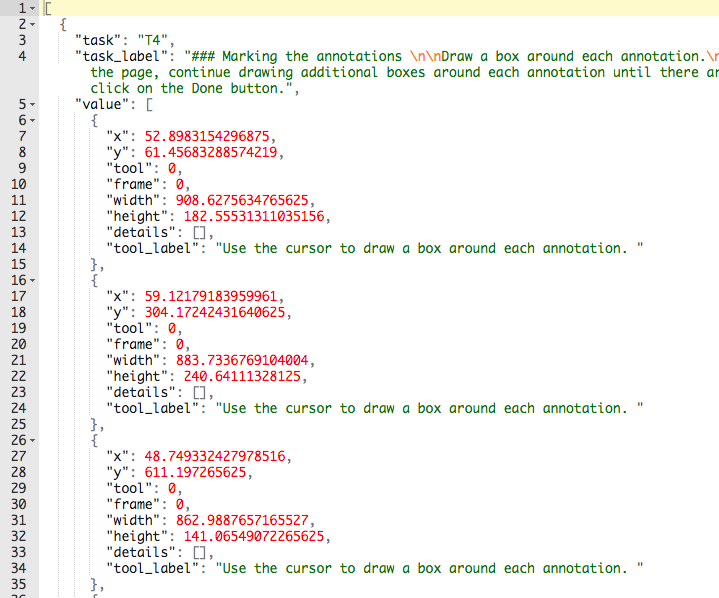
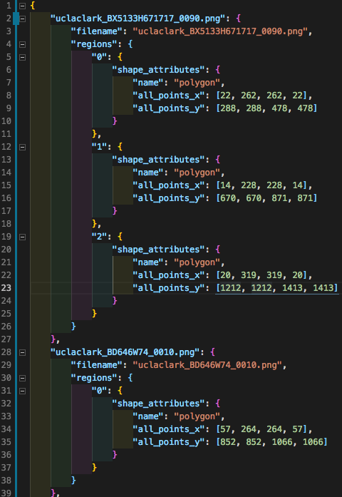

# Omniscribe training data: collecting and processing

## Files and Directories

* `rawData.csv`: This csv files stores all the labeled data created from zooniverse users. The data includes regions of interests that were labeled and provides some information of the user who marked them. Further processing of this data is needed before it can be trained.

* `extractROIs.py`: This script takes the `rawData.csv` file (hard-coded) and generates `data.json`, a JSON file that contains all the images listed on Zooniverse along with all the regions that they may have. The JSON itself is a relatively complex object that stores many images, and those images may themselves have lists of ROIs.

    To put it simply, every image has a list of ROIs, and every ROI is made up of an `all_points_x"` array and an `all_points_y` array such that `all_points_x[i]` and `all_points_y[i]` make up a coordinate point, where every region would have four of these coordinate points (to make a rectangle that captures the ROI). The ROIs are constructed this way to fit Mask R-CNN structure requirements.

* `data.json`: The resulting file generated from `extractROIs.py`. It contains all the images with their labeled annotations from `rawData.csv`. It is to be used with `datasetGenerator.py` in order to generate datasets that are ready for training.

* `datasetGenerator.py`: This scripts reads `data.json` and generates three JSON files for training, validation, and testing. Each of these files have to be renamed to `via_region_data.json` and are to be placed in the same directory where the images they represent are located. Note that changing the `SEED` value will create different datasets.

* `annotation-datasets/`: Contains a training set and a validation set for images that contain handwriting. Note that training the model assumes daughter directories "train" and "val" where those directories contain only images.

### 1. Gathering Data

To collect the labeled data, we used [Zooniverse](https://www.zooniverse.org/), a platform for crowd-sourcing data, annotations, etc. In total we had **4143** annotations across 1079 images. These annotations make up the `rawData.csv` file.

### 2. Formatting the Raw Data

In order to leverage [Mask R-CNN](https://github.com/matterport/Mask_RCNN) to detect annotations, we need to provide the training data and validation data, namely the images and their corresponding regions of interests (ROIs). The data is formatted in a JSON file as follows:

```javascript
{
    "Image1": {
        "imgName": "Image1.png",
        "regions": {
            "0": {
                "shape_attributes": {
                    "name": "polygon",
                    "all_points_x": [X1, X2, X2, X1],
                    "all_points_y": [Y1, Y1, Y2, Y2]
                }
            },
            "1": {
                "shape_attributes": {
                    "name": "polygon",
                    "all_points_x": [X1, X2, X2, X1],
                    "all_points_y": [Y1, Y1, Y2, Y2]
                }
            },
            "2": {
                "shape_attributes": {
                    "name": "polygon",
                    "all_points_x": [X1, X2, X2, X1],
                    "all_points_y": [Y1, Y1, Y2, Y2]
                }
            }
        }
    },
    "Image2": {
        "imgName": "Image2.png",
        "regions": {
            "0": {
                "shape_attributes": {
                    "name": "polygon",
                    "all_points_x": [X1, X2, X2, X1],
                    "all_points_y": [Y1, Y1, Y2, Y2]
                }
            },
            "1": {
                "shape_attributes": {
                    "name": "polygon",
                    "all_points_x": [X1, X2, X2, X1],
                    "all_points_y": [Y1, Y1, Y2, Y2]
                }
            }
        }
    }
    // ...
}
```

The JSON file has images as keys, where each image has a name and one or more regions (labeled bounding boxes) on that image.
Every region is labeled as a polygon; `all_points_x` and `all_points_y` store *x* and *y* coordinates that form a rectangle, present like this:
 

`extractROIs.py` generates a `data.json` file that formats the data to look more like this:
 

 Note that the formatting here is arbitrary;  it could be stored in a CSV or other format. We chose this format following [VIA](http://www.robots.ox.ac.uk/~vgg/software/via/), an image annotation tool using this convention.

### 3. Generating the datasets

 `datasetGenerator.py` splits `data.json` to roughly a 70/15/15 split (70% of the annotations are for training, 15% of the annotations are for validation, and 15% of the annotations are for testing). This split is necessary in order to tune hyperparameters and ultimately prevent overfitting. With `SEED = 42`, we had **2901** annotations for training, **627** annotations for validation, and **615** annotations for testing.
